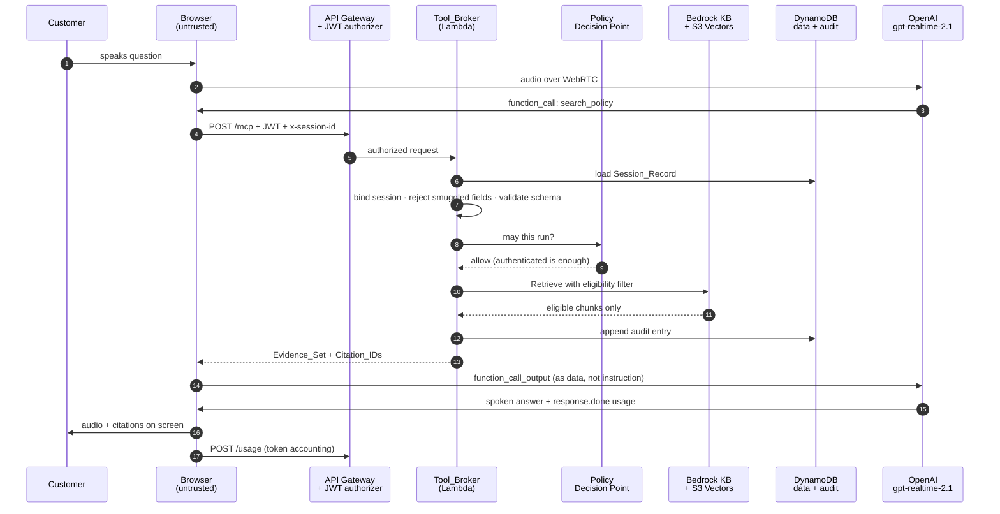

# BFSI Assistant — Solution Reference

How the system works, what each component is responsible for, where it falls
short, and what the fix is for each shortcoming.

**Deployed:** account `123456789012`, `us-east-1`
**Client:** https://<distribution-id>.cloudfront.net · token dashboard at `/token`
· operator view at `/ops` · claims copilot at `/healthcare`
**Model:** OpenAI `gpt-realtime-2.1`, speech-to-speech over WebRTC
**Knowledge base:** Bedrock `<knowledge-base-id>` on S3 Vectors

Sections 1–10 describe the voice advisor. **Section 11** describes a second,
deliberately narrower workflow — the Claims Resolution Copilot — which shares the
same Lambda, Cognito pool and audit chain but uses a different OpenAI surface and a
different governance shape.

---

## 1. What the system does

An authenticated retail-banking customer speaks or types a question. The advisor
answers **only** from retrieved enterprise policy, decides separately whether the
customer is permitted to act, verifies their identity when the action demands it,
executes enterprise tools inside AWS, and hands off to a human when it cannot
answer safely.

Two properties define it, and everything below exists to hold one of them:

1. **It cannot invent policy.** Every policy statement traces to a retrieved
   document and version, or it is withheld.
2. **It cannot grant itself permission.** Authorization, identity assurance, and
   document eligibility are decided outside the model, from server-side state.

---

## 2. End-to-end flow

### 2.1 Session establishment

```
Browser ──1──> Cognito                      username + password → ID token (JWT)
Browser ──2──> API Gateway → Lambda         POST /session, Bearer <JWT>
               Lambda:
                 · JWT already validated by the API Gateway authorizer
                 · maps cognito:username → customer record in DynamoDB
                 · writes Session_Record (assurance = authenticated, TTL 1 h)
                 · reads OpenAI key from Secrets Manager
                 · POST api.openai.com/v1/realtime/client_secrets
                 · writes audit entry seq 1: session.create
Browser <──3── { session_id, client_secret, model, disclosure }
```

The browser receives a **short-lived ephemeral credential**, never the OpenAI API
key. Instructions, tool declarations, model id, and reasoning effort are fixed by
the Lambda at mint time and cannot be altered by the client.

### 2.2 The conversation

```
Browser ──4──> OpenAI          WebRTC: SDP offer to /v1/realtime/calls
                               Authorization: Bearer <ephemeral credential>
Browser <═══> OpenAI           audio both ways + data channel "oai-events"
```

Audio never transits AWS. The browser holds the media session directly.

### 2.3 A tool call

```
OpenAI ──5──> Browser          data channel: response.function_call_arguments.done
Browser ──6──> API Gateway → Lambda   POST /mcp  (JSON-RPC tools/call)
                                      headers: Bearer <JWT>, x-session-id
               Tool_Broker runs the fixed sequence in §4
Browser <──7── structured Tool_Result
Browser ──8──> OpenAI          conversation.item.create (function_call_output)
                               + response.create
OpenAI ──9──> Browser          spoken answer, then response.done with usage
Browser ──10─> Lambda          POST /usage (token accounting)
```

The browser is a **transport** for tool calls, not an executor. It forwards the
call and carries the result back. Everything that reads data, changes state, or
decides permission happens inside the Lambda.



The same path runs for a state-changing tool, with two differences: the Policy
Decision Point requires `assurance = verified`, and the audit entry is written
**before** execution so that a failed audit write refuses the action.

### 2.4 The reference scenario, concretely

> *"I want to close my account, but I'm travelling internationally right now.
> What documents do you need, and can you start the request?"*

| # | Actor | What happens |
|---|---|---|
| 1 | Model | calls `search_policy("closing account from abroad")` |
| 2 | Tool_Broker | builds filter from Session_Record: `access_classification IN [public, customer]` AND `geography IN [UK, GLOBAL]` |
| 3 | Bedrock KB | evaluates the filter **during** the vector search, returns eligible chunks only |
| 4 | Tool_Broker | attaches Citation_IDs, sorts current versions above superseded, detects version conflict |
| 5 | Model | speaks the requirements, naming *UK Closure Policy v3.0* |
| 6 | Model | calls `check_customer_entitlement("close_account")` → permitted, needs `verified` |
| 7 | Model | calls `create_service_request` → **denied**, `not_permitted`, assurance too low |
| 8 | Model | calls `verify_customer_identity()` → code issued to a registered channel |
| 9 | Customer | reads the code back |
| 10 | Tool_Broker | code matches → Session_Record assurance raised to `verified` for 10 minutes |
| 11 | Model | calls `create_service_request` again → allowed, `SR-…` created on `acct-9001` |

The account id comes from the Session_Record, not from anything the model said.

---

## 3. Component roles

| Component | Implementation | Responsible for | Explicitly not responsible for |
|---|---|---|---|
| **Customer_Client** | S3 + CloudFront, vanilla JS | Capturing audio/text, holding the WebRTC session, rendering evidence and citations, forwarding tool-call events | Executing tools, holding credentials, deciding anything |
| **Cognito** | User pool + app client | Authenticating the customer, issuing the JWT, asserting authentication strength | Authorizing actions |
| **API Gateway** | HTTP API + JWT authorizer | Validating the JWT on every request, throttling at 10 rps / 20 burst | Business logic |
| **Session_Broker** | Lambda, `POST /session` | Mapping identity → customer, creating the Session_Record, minting the ephemeral credential, fixing session configuration | Any per-turn decision |
| **Tool_Broker** | Lambda, `POST /mcp` | The single entry point for every action: binding, validation, authorization, execution, audit | Trusting any client-supplied claim |
| **Policy_Decision_Point** | `policy.py` + `authorization_policy.json` | Deciding permitted/denied from role, entitlement, assurance, deny-by-default | Reading model output |
| **Retrieval_Service** | `retrieval.py` → Bedrock `Retrieve` | Building the eligibility filter from the Session_Record, ranking, citation metadata | Deciding what a customer may see (that comes from the session) |
| **Bedrock Knowledge Base** | KB `<knowledge-base-id>`, Titan Embed v2 | Managed chunking, embedding, and filtered vector search | Nothing customer-specific — the filter is passed per query |
| **S3 Vectors** | `ea-policy-index`, 1024-dim cosine | Vector storage, metadata filter evaluation during search | — |
| **DynamoDB data** | single table, `pk`/`sk` | Customers, sessions, service requests, escalations, idempotency keys, usage aggregates | Audit records |
| **DynamoDB audit** | `session_id`/`seq` | Append-only hash-chained record of every decision | — |
| **Secrets Manager** | `enterprise-advisor/openai` | Custody of the long-lived OpenAI key | — |
| **CloudWatch** | Log group + metrics | Per-turn telemetry, no customer content | — |
| **OpenAI** | `gpt-realtime-2.1` | Understanding intent, synthesising the answer, choosing which tool to call, speech | Authorization, identity, eligibility, reporting what happened |

### The eight tools

| Tool | Assurance | State change | Scope-limited |
|---|---|---|---|
| `search_policy` | authenticated | no | eligibility filter |
| `get_policy_details` | authenticated | no | eligibility filter |
| `verify_customer_identity` | authenticated | no | registered channel only |
| `check_customer_entitlement` | authenticated | no | reports, never grants |
| `get_customer_profile` | authenticated | no | own record, email masked |
| `create_service_request` | **verified** | yes | own account, idempotency key |
| `get_request_status` | authenticated | no | own requests |
| `escalate_to_human` | authenticated | yes | — |

---

## 4. The Tool_Broker sequence

Every tool call runs through one function in one fixed order. This is why
"single authority" holds by construction rather than by convention.

```
1  Authenticate      JWT sub present (API Gateway already validated the token)
2  Load session      Session_Record by x-session-id; reject if absent or expired
3  Bind session      Session_Record.cognito_sub == JWT sub, else reject + audit
4  Reject smuggling  any of customer_id, account_id, assurance_level,
                     entitlements, eligible_classifications in the arguments
                     → reject + audit as Injection_Attempt
5  Validate schema   required fields, types, enum membership, no unknown keys
6  Authorize         Policy_Decision_Point: entitlement + assurance + scope,
                     deny-by-default; on deny → audit + not_permitted envelope
7  Pre-audit         state-changing tools only: append audit entry first.
                     If the audit write fails, refuse the action (fail closed)
8  Execute + audit   run the tool, append the result entry, increment counters
```

Steps 3, 4, and 6 are the security core. Step 7 is the fail-closed rule.

---

## 5. Data model

**Session_Record** — `pk=SESSION#<id>`, `sk=META`, TTL 1 h
```
session_id · customer_id · cognito_sub · assurance_level · assurance_expires_at
eligible_classifications[] · accounts[] · geography · challenge_code
challenge_expires_at · challenge_attempts
```

**Audit_Chain** — `session_id` / `seq`, one chain per session
```
seq · prev_digest · digest · ts · request_id · customer_id
action · decision · reason · policy_version · result_status
latency_ms · cited_documents[] · argument_names[]

digest = SHA256(prev_digest ‖ canonical_json(entry without digest))
```
The Lambda role holds `GetItem`, `PutItem`, `Query` on this table — no
`UpdateItem`, no `DeleteItem`.

**Document metadata** — per vector, all filterable
```
document_id · title · version · effective_date · business_domain
geography · access_classification · superseded · section_ref
```

**Corpus** — 12 documents: 4 `public`, 6 `customer` (both eligible),
1 `internal`, 1 `restricted` (never eligible). Includes `POL-CLOSURE-UK` at both
v3.0 and superseded v2.0 to exercise conflict detection, and a deliberate
prompt-injection payload inside the restricted document.

---

## 6. Trust boundaries

| Boundary | Assumption | Enforcement |
|---|---|---|
| Browser → AWS | Fully adversarial. Nothing it asserts is trusted | JWT validation, session binding, smuggled-field rejection |
| Browser → OpenAI | Customer can tamper with what the model is told | No data access or state change without the Tool_Broker; audit is authoritative |
| Retrieved document → model | Documents may contain instructions | Evidence delivered as fenced data, separated from instructions |
| Model → tools | Model may request anything | Schema validation, deny-by-default policy, assurance gate |
| Model → customer | Model may fabricate | Retrieval-required rule, server-authored citations |
| Application → audit | Application may try to rewrite history | Hash chain, conditional writes, IAM without update or delete |

---

## 7. Shortcomings and mitigation plan

Ordered by risk. Each row states what is wrong, what protects against it today,
and what the actual fix is.

### 7.1 Behavioural

| # | Shortcoming | Impact | Today | Fix | Effort |
|---|---|---|---|---|---|
| B1 | A realtime model sometimes begins answering **before** calling `search_policy`. The system prompt forbids it, but a prompt is not a control | A policy answer could reach the customer with no evidence behind it | Egress-side citation closure catches fabricated *citations*, not fabricated *prose* | Server-side grounding gate: the relay-equivalent layer tracks whether retrieval ran for the turn and forces `insufficient_evidence` if not. Requires moving envelope assembly server-side | 2–3 days |
| B2 | Citations are attached at **turn level**, not per sentence | A turn citing three documents does not say which sentence came from which | Every cited document is guaranteed to be in that turn's Evidence_Set | Pre-approval tool: model submits answer text with per-statement citation ids, broker validates before speech. Adds a 9th tool and ~300 ms | 3–4 days |
| B3 | The model occasionally reads the step-up code aloud instead of asking the customer to | Undermines the point of a step-up challenge | Prompt instruction only | Never send the code to the model at all — return only "challenge issued", and validate the customer's spoken code against the stored value | 1 day |

### 7.2 Architectural

| # | Shortcoming | Impact | Today | Fix | Effort |
|---|---|---|---|---|---|
| A1 | The **browser holds the model session**, so a determined customer can skip the Tool_Broker and feed the model a fabricated tool result | The model may say something false *to that same customer*. No data access, no state change, audit unaffected | Accepted residual risk. Enforcement is server-side; the audit chain records what actually ran | Server-side session relay on Fargate. Browser carries audio only. Costs ~$9/month plus egress and reintroduces a single point of failure | 1 week |
| A2 | **Self-scope resolution is per-tool**, not centralised. `create_service_request` reads accounts from the session, but each new tool must remember to | A future tool could trust a model-supplied identifier | Step 4 rejects the known protected field names; the smoke test asserts scope containment | Move identifier resolution into the broker: strip all identifiers from arguments and inject from the Session_Record before dispatch | 1–2 days |
| A3 | **Envelope assembly is client-side.** The Response_Envelope, confidence status, and citation list are composed in the browser from tool results | The customer's own display could be manipulated; server has no canonical transcript | Tool results themselves are server-authored | Assemble the envelope server-side and return it as the tool result, with the client rendering only | 2–3 days, overlaps B1 |
| A4 | **Egress filtering is partial.** Requirement 15 specifies a full outbound inspection; only citation closure is implemented | A model could name an internal system or role in prose | Prompt instruction plus the fact that ineligible documents are never retrieved | Implement the Egress_Filter as a discrete server-side step once A3 lands | 2 days |
| A5 | Knowledge base is provisioned by **boto3, not CDK**, because CloudFormation has no S3 Vectors storage type | Deployment is two steps; drift is possible | `scripts/setup.py` is idempotent and re-runnable | CDK custom resource wrapping the same calls, or native support when it ships | 2 days |

### 7.3 Security hardening

| # | Shortcoming | Impact | Today | Fix | Effort |
|---|---|---|---|---|---|
| S1 | **MFA is not enforced.** The user pool supports it and the broker validates the strength claim in code, but enforcement is off so demo sign-in is one step | Password-only authentication on a customer channel | Strong password policy, `prevent_user_existence_errors` | Turn on MFA in the user pool and require the `amr` claim at the Session_Broker | 0.5 day |
| S2 | **No WAF.** API Gateway throttling stands in | A distributed source can still consume quota and model spend | 10 rps / 20 burst, per-session turn and audio quotas | WAF with rate-based and per-source rules in front of CloudFront and the API | 1 day |
| S3 | **AWS-managed encryption keys**, not customer-managed | No scoped key policy, no independent rotation control | Everything is encrypted at rest and in transit | Customer-managed KMS key with automatic rotation, key policy limited to the two roles | 1 day |
| S4 | **Audit chain is single-region** with no immutable off-region copy | Regional loss or a privileged actor with table access could destroy history | Hash chain makes tampering detectable, PITR enabled, RETAIN on stack destroy | Continuous export to S3 with Object Lock in compliance mode, in a second region | 2 days |
| S5 | `/usage-summary` returns **global** aggregates to any authenticated customer | A customer can see system-wide token totals | Demo-only surface, no customer content exposed | Gate on an operator group claim, or move the dashboard behind a separate admin pool | 0.5 day |
| S6 | The token dashboard shows the **step-up code** for the signed-in fixture persona | Would be a serious flaw in production | Client-side only, from a hard-coded persona list; the server never sends it | Delete the persona code list before any non-demo use | 10 minutes |

### 7.4 Operational

| # | Shortcoming | Impact | Today | Fix | Effort |
|---|---|---|---|---|---|
| O1 | **No CloudWatch alarms.** Metrics are logged but nothing pages | An injection spike or audit-write failure goes unnoticed | Structured per-turn logs, queryable | Alarms on injection-attempt rate, audit-write failure, 5xx rate, p95 latency → SNS | 1 day |
| O2 | **Escalation has no consumer.** The record is written and nothing routes it to a person | An escalated customer is given a reference, but no colleague is notified | Record is complete and queryable: cited documents, tool history, denials, assurance, accounts — all rebuilt from the audit chain | Publish to EventBridge on write, then either an Amazon Connect task for voice-back or a CRM queue for async. See §10 | 3–5 days |
| O3 | **No data-subject-request tooling** | Cannot service an access or erasure request | DynamoDB TTL expires session, transcript, and usage data on a schedule | Access and erasure endpoints that preserve audit entries required for record-keeping | 3 days |
| O4 | **Single region, no autoscaling, no DR runbook** | No failover; recovery is undocumented | All serverless, so capacity scales implicitly; nothing is hourly-provisioned | Multi-region with audit replication, documented RTO/RPO, restore rehearsal | 1–2 weeks |
| O5 | **Fixture identities and corpus.** 12 documents, 4 users, no real IdP | Evaluation numbers are regression signals, not accuracy evidence | Clearly labelled as fixtures throughout | Enterprise IdP federation, real corpus ingestion, shadow-mode evaluation on live traffic | 2 weeks |
| O6 | **Teardown is not clean.** The audit table is `RETAIN`, and the vector bucket, knowledge base, and IAM role sit outside the stack | Orphaned resources after `cdk destroy` | Documented in `scripts/inventory.py` output | Teardown script covering the boto3-provisioned resources; keep RETAIN on audit deliberately | 0.5 day |

### 7.5 Sequenced plan

**Phase 1 — harden, 4–6 weeks.** S1, S6, S2, S3, S4, O1, then B1 and A3 together
(they share the same server-side envelope work), then A2, B3, A4.
Rationale: the cheapest fixes with the highest assurance value first, then the
one behavioural weakness that a prompt cannot fix.

**Phase 2 — scale the corpus.** A5, O2, O5, plus SQS-buffered ingestion,
per-domain indexes, a reranker, and AWS Verified Permissions as an external
policy decision point.

**Phase 3 — scale the traffic.** A1 if an assurance review requires it,
provisioned concurrency, O4, per-tenant model budgets.

**Not planned.** B2 per-sentence citations, unless a regulator asks. The cost is
a permanent extra round trip on every turn and the benefit over turn-level
attribution is narrow.

---

## 8. What is verified today

`python3 scripts/smoke_test.py` — 25 of 25 passing against the deployed stack:

- unauthenticated request rejected; 8 tools listed
- internal and restricted documents never returned, including under a query
  written specifically to surface the internal retention playbook
- public-only customer receives `classes = ['public']` for the identical question
- closure denied at `authenticated`, permitted after a correct step-up code,
  wrong code rejected with attempts remaining
- customer without `close_account` refused regardless of verification state
- created request lands on `acct-9001` taken from the session, not the arguments
- idempotent replay returns the same request id
- cross-customer request returns no existence hint
- client-supplied `customer_id` and `assurance_level` rejected
- session presented by a different identity rejected
- enum and required-argument validation
- audit chain verifies intact; a silent field edit is caught at the tampered entry

Separately proven by hand: tampering an audit entry with admin credentials
returns `break_at: 2, digest mismatch`, and the Lambda role cannot make that edit.

`python3 scripts/bfsi_test.py` — 36 of 36, covering the domain arithmetic in
`bfsi.py`: UPI compensation, health claim proportionate deduction and co-pay, loan
foreclosure quotes, risk-based KYC cycles.

`python3 scripts/claims_test.py` — 53 of 53, covering the second workflow. Detailed
in §11.4.

---

## 9. Handoff to a human

### 9.1 What triggers it

`escalate_to_human` is called on any of:

| Trigger | Condition |
|---|---|
| Insufficient evidence | Retrieval returned nothing eligible and the clarification limit is reached |
| Conflicting evidence | Two live versions of the same document answer the question differently |
| Tool failure | A tool errored or timed out after the configured retries |
| Verification exhausted | Step-up challenge failed more than three times |
| Not permitted | Entitlement denial where the customer still needs the outcome |
| Customer asks | Any request for a person, honoured immediately with no qualification |
| Regulated advice | The guardrail blocked a personalised recommendation |

### 9.2 What the record contains

Context is **rebuilt from the audit chain**, not taken from the model, so it
reflects what the system actually did:

```json
{
  "escalation_id": "ESC-E18BD77B",
  "status": "queued",
  "customer_id": "cust-1002",
  "session_id": "…",
  "reason": "not entitled to close, customer wants a person",
  "summary": "Joint holder asking to close from abroad",
  "context": {
    "assurance_level": "authenticated",
    "geography": "US",
    "accounts": ["acct-9002"],
    "eligible_classifications": ["public", "customer"],
    "documents_cited": ["POL-CLOSURE-US", "POL-INTL-SERVICING",
                        "FAQ-CLOSURE", "POL-DATA-PRIVACY"],
    "denials": [{"action": "tools/create_service_request",
                 "reason": "Creating this request needs a verified session."}],
    "tool_history": [{"tool": "search_policy", "status": "ok"},
                     {"tool": "check_customer_entitlement", "status": "ok"},
                     {"tool": "create_service_request", "status": "not_permitted"}],
    "verification_attempts": 0,
    "audit_entries": 5
  }
}
```

The colleague can see what was asked, which policy the customer was already shown,
what was refused and why, and how far identity verification got — so they do not
re-interview the customer or contradict what the advisor said.

Written to the data table as `pk=CUSTOMER#<id>`, `sk=ESC#<escalation_id>`.
The customer receives only the reference.

### 9.3 What is missing

Nothing routes the record to a person. `status` stays `queued` forever. The
customer is told a colleague has the context, and today that is not true.

### 9.4 Production design

Two handoff modes, and the choice depends on the trigger rather than preference:

**Warm voice transfer** — for a customer already talking and blocked mid-journey.
The escalation publishes to EventBridge, a consumer creates an Amazon Connect
contact with the context attached as contact attributes, and the browser joins the
Connect chat or voice session. The advisor session ends cleanly rather than
being abandoned. Right for *not permitted* and *verification exhausted*, where the
customer is present and waiting.

**Asynchronous task** — for cases where no colleague can help in the next few
seconds anyway. The same EventBridge event creates a Connect task or a CRM case,
the customer is told they will be contacted, and the session closes. Right for
*conflicting evidence* and *regulated advice*, which need a specialist rather than
the next available agent.

Either way the seam is the same and it already exists: the Escalation_Record plus
an EventBridge publish on write. What changes is the consumer.

Two things worth building alongside:

- **A colleague view.** Escalation_Records are queryable but there is no UI. The
  minimum is a list with the context panel already produced above.
- **Closing the loop.** `status` should move `queued → assigned → resolved`, and
  a resolved escalation with the colleague's outcome is the highest-value
  evaluation signal available — it is a labelled example of a case the advisor
  could not handle.

---

## 10. Operations

```bash
python3 scripts/inventory.py       # every provisioned resource, tags, cost shape
python3 scripts/smoke_test.py      # 25 checks against the deployed stack
python3 scripts/check_openai.py    # is the key able to drive the deployment
python3 scripts/setup.py           # re-seed corpus and re-run ingestion (idempotent)
python3 scripts/deploy_web.py      # rebuild config.js, upload client, invalidate
python3 scripts/create_users.py    # reset fixture user passwords
```

Deploy infrastructure:

```bash
cd infra
CDK_DEFAULT_ACCOUNT=$(aws sts get-caller-identity --query Account --output text) \
CDK_DEFAULT_REGION=us-east-1 \
npx -y aws-cdk@2.1136.0 deploy --app "../.venv/bin/python app.py" \
  --require-approval never --outputs-file ../.deploy/outputs.json
```

The pinned `npx` version matters: the globally installed CDK CLI is older than
`aws-cdk-lib` and fails with a cloud-assembly schema mismatch.

---

## 11. Second workflow — Claims Resolution Copilot

At `/healthcare`. A different user, a different OpenAI surface, and a different
governance shape from the voice advisor, on the same infrastructure.

**Scenario.** Apex Health Services is a fictional Third Party Administrator settling
cashless hospitalisation claims under the IRDAI framework. One claim has arrived:
`CLM-48291`, a total knee replacement in Bengaluru, ₹4,85,000 billed against a
₹5,00,000 family floater. A Claims Operations Specialist has to decide whether it
can be settled.

The package is imperfect in three ways, and the point of the demo is that they are
not the same *kind* of imperfect:

| | Problem | Correct response |
|---|---|---|
| 1 | Implant invoice absent | query to the hospital (POL-IMP-7.3) |
| 2 | Implant batch sticker absent | query to the hospital (POL-IMP-7.3) |
| 3 | Pre-auth reference not on the final bill | query to the hospital (POL-PA-5.2) |
| 4 | Room tariff ₹12,000/day vs ₹5,000 eligible | **deduction, not a query** (POL-RR-4.1) |

Merging 4 into the query letter is the operational error the design blocks. Clause
POL-QRY-9.1 forbids restating the deduction position in a query — the hospital is
not being asked for anything, so a letter mentioning it restarts the clock for no
reason.

### 11.1 How it differs from the voice advisor

| | Voice advisor (§1–10) | Claims copilot |
|---|---|---|
| User | the bank's customer | a TPA's claims specialist |
| OpenAI surface | Realtime API over WebRTC | Responses API, `gpt-5.6-terra`, strict `json_schema` |
| Retrieval | Bedrock KB, deny-by-default eligibility | none — one curated package in the prompt |
| Output | speech, plus tool calls | one structured recommendation object |
| Outcome authority | `Policy_Decision_Point` on entitlement | a human decision call |
| New AWS services | — | none |

Retrieval is deliberately absent. One claim and six clauses fit in the prompt, so
there is no retrieval failure mode to reason about, and the demo stays about the
governance boundary rather than about search.

### 11.2 The two boundaries it enforces

**The model never settles the claim.** `POST /claim-decision` accepts `approve`,
`edit` or `reject` and nothing else. It is the only call that produces a business
outcome, it is authenticated as the specialist, it writes to the hash-chained audit
under `CLAIMS#<review_id>`, and it returns 409 if the recommendation failed a
blocking check. The model has no route to it.

**The model never produces money.** Three layers, in increasing strength:

1. The instructions forbid it. *A prompt is not a control* — this makes compliance
   likely, not guaranteed.
2. The output schema has no amount field. `deductions_applicable` carries `type`,
   `applies`, `basis_source_id` and `reason`. There is nowhere to put a figure.
3. `validate()` scans the model's own prose — summary, rationale, gap items and
   reasons, deduction reasons, letter subject and body — for `₹`, `Rs`, `INR`,
   `rupee`, `lakh`, `crore`, and comma-grouped digit groups in Indian or Western
   form. A hit is a **blocking** failure. `evidence[].quote` is exempt, because a
   verbatim clause quote may legitimately contain a figure and quotes are separately
   verified against the source text.

Bare integers are deliberately not matched: *clause 7.3*, *24 hours* and *36 months*
are all legitimate, and a digit rule would flag every one.

Every rupee figure in the response comes from `claims.settlement_estimate()`, which
is arithmetic over the billed heads with no model involvement:

```
eligible room rent   1% of ₹5,00,000        = ₹5,000/day
actual room tariff                            ₹12,000/day
proportion payable   5,000 / 12,000         = 0.41667

room-variable heads (POL-RR-4.1)
  room and nursing            ₹48,000  →  ₹20,000
  surgeon and anaesthetist  ₹1,45,000  →  ₹60,417
  operation theatre           ₹62,000  →  ₹25,833
                            ─────────     ────────
                            ₹2,55,000    ₹1,06,250   deduction ₹1,48,750

not room-variable
  implant and prosthesis    ₹1,68,000  →  ₹1,68,000
  pharmacy and consumables    ₹41,000  →    ₹41,000
  investigations              ₹21,000  →    ₹21,000

payable if the package completes             ₹3,36,250   (within pre-auth ₹4,20,000)
payable if the implant stays unevidenced     ₹1,68,250   (POL-IMP-7.3 removes the head)
value of the query                           ₹1,68,000
```

That last figure is the one that matters operationally: it is what chasing the
hospital is worth, and therefore whether the query is worth raising.

### 11.3 The gate

17 named checks run on every recommendation. Nine block; the rest inform.

| Blocking | Check |
|---|---|
| ● | Schema conformance |
| ● | Status in allow-list · Action in allow-list |
| ● | Evidence cites only supplied sources |
| ● | Quotes appear verbatim in the source |
| ● | Every gap traced to a source · Every deduction traced to a source |
| ● | **No amount asserted by the model** |
| ● | **Completeness gaps kept separate from deductions** |
| | No request for already-supplied documents |
| | Absent documents identified |
| | Room-rent deduction identified |
| | Draft references the correct claim |
| | Query letter omits the deduction position |
| | Draft avoids full-record requests |
| | Draft withholds insured identity |
| | No settlement asserted by the model |

The split is principled: **structured-field checks block, prose heuristics inform.**
A check that reads a JSON field is exact. A check that reads English is a judgement,
and a judgement should not be able to make a correct recommendation unapprovable.

The one exception is the money rule, which is a regex over prose and blocks anyway,
because it is the central claim of the design. It is backed by 15 unit cases —
8 legitimate strings that must not trip it, 7 figures that must.

Two prose checks required more care than expected:

- **Whole-record requests.** A substring match on *"full clinical record"* cannot
  distinguish a request from a prohibition. `_full_record_request()` inspects the
  four tokens before the phrase for negation, because *"no full clinical record is
  requested"* is compliance, not breach. A bare determiner `no` is not the token
  `not`, which an earlier version missed.
- **Deduction language in the letter.** Non-blocking, because *"deduction"* can
  appear in a legitimate sentence and the cost of a false positive is a dead-ended
  review.

### 11.4 What is verified

`python3 scripts/claims_test.py` — 53 of 53 passing against the deployed stack.
Beyond the workflow itself:

- the room-rent clause is never raised as a missing document
- the proportionate deduction is flagged, and carries no amount
- no rupee figure appears anywhere in the model's own prose
- all five settlement figures match the arithmetic exactly
- only the three room-variable heads reduce; the other three do not
- the letter withholds the insured's name and date of birth, states the 15-day
  period from POL-TAT-2.4, and never mentions the room tariff
- `settle` is rejected as a decision; a second specialist cannot decide the review

### 11.5 Known limits

| | Limit | Fix |
|---|---|---|
| C1 | One claim, hard-coded as a fixture | ingest from the TPA claims system; the package shape is already the interface |
| C2 | No retrieval, so clause selection is curated | the voice advisor's KB path applies unchanged once the clause library grows |
| C3 | Approval records an outcome but writes to no downstream system | the write point is marked in `handle_claim_decision`; needs a TPA integration |
| C4 | A blocking failure dead-ends the review — Edit is disabled too | correct today (a blocked recommendation must be re-run) but a "re-run with feedback" path would be better |
| C5 | Deduction language in the letter is a heuristic, not a proof | a clause-aware structural check on letter content |

### Related documents

| File | Contents |
|---|---|
| `.kiro/specs/enterprise-advisor/requirements.md` | 27 EARS requirements, glossary, deferral list |
| `.kiro/specs/enterprise-advisor/design.md` | Trade-offs, correctness properties, threat model |
| `DEMO_SCRIPT.md` | Presenter script, Q&A crib sheet, failure recovery, claims appendix |
| `diagram/EnterpriseAdvisor-Review.pptx` | 13-slide review deck with speaker notes |
| `README.md` | Quick start and fixture reference |
